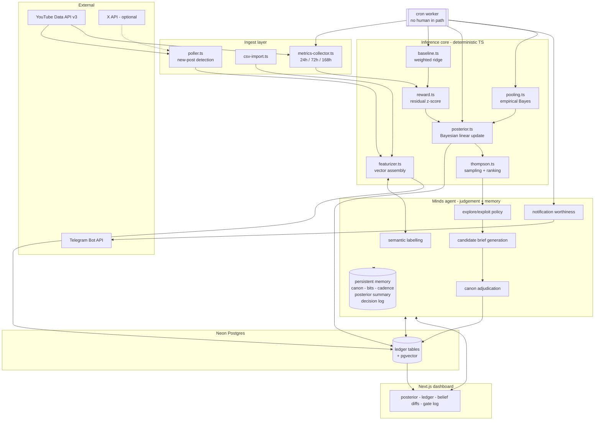

# RATCHET — Technical Architecture

**Version** 1.0 · **Date** 2026-08-22 · Companion to `docs/PRD.md`

---

## 1. Architectural thesis

One sentence: **the Mind holds judgement and state, TypeScript holds arithmetic, Postgres holds
the ledger, and cron closes the loop without a human.**

Three invariants that everything else follows from:

1. **No numeric inference inside the LLM.** Posterior updates, ridge fits and matrix algebra are
   deterministic TypeScript. The Mind reads results and writes decisions; it never computes them.
2. **No state outside the Mind that the Mind cannot see.** Postgres is the durable store, but every
   fact that shapes a decision is mirrored into Mind memory as a compact summary, so the agent is
   coherent even when the DB layer is not in the prompt.
3. **The autonomous path contains no user code path.** The cron worker must be able to mature an
   experiment, update beliefs and send a message with the dashboard closed and nobody logged in.
   If any step needs a request from a browser, the persistence claim is false.

---

## 2. System diagram



---

## 3. Component inventory

| Component | Runtime | Responsibility | Non-responsibility |
|---|---|---|---|
| `apps/web` | Next.js (bun) | Dashboard, chat surface, OAuth callback | Never computes posteriors |
| `apps/worker` | bun cron | Maturation, nightly fits, pooling, notifications | Never renders |
| `packages/core` | TypeScript lib | Ridge, Bayesian update, Thompson, pooling | No I/O, pure functions |
| `packages/mind` | TypeScript lib | Minds SDK wrapper, memory read/write contracts | No math |
| `packages/db` | TypeScript lib | Schema, migrations, typed queries | No business logic |
| `packages/connectors` | TypeScript lib | YouTube, CSV, X | No featurisation |

Monorepo, bun workspaces. TypeScript everywhere. No Python.

---

## 4. Data flow — the four loops

### Loop A — Ingest (every 30 min)

```
poller → platform API → new post detected
       → posts row inserted
       → Mind labels hook_type / thumbnail_archetype / topic_cluster
       → label written to features table AND to Mind memory (stable label)
       → experiment row created, status = open, maturation schedule stamped
```

Idempotency key: `(creator_id, platform_post_id)`. Re-polling never duplicates.

### Loop B — Maturation (hourly scan)

```
worker scans experiments where next_checkpoint <= now()
  → metrics-collector fetches views / watch_time / comments / follower_delta
  → metrics row written for that checkpoint
  → if checkpoint == 168h:
        status = closed
        reward = clip( (log(views) - log(views_hat)) / sigma_resid , -4, +4 )
        posterior.update(creator, x_i, r_i)   # incremental, idempotent by experiment id
        belief_diff written  (which weights moved, by how much, caused by which experiment)
        Mind.evaluateNotification(belief_diff)
```

The 168h close is the only event that teaches. 24h and 72h are display-only signals (PRD FR-3.4).

### Loop C — Nightly refit (03:00 creator-local)

```
baseline.fit(creator)            # weighted ridge, half-life 90d
posterior.recompute(creator)     # full recompute from ledger, guards against drift
pooling.updateNichePriors()      # empirical Bayes across creators
posterior_snapshots.write(week)  # enables the week-1 vs week-N time-travel view
```

Incremental updates in Loop B keep the product live; the nightly full recompute keeps it correct.
Divergence between the two is logged as a health metric.

### Loop D — Act (on demand or after a material belief change)

```
Mind generates K=8 candidate briefs from canon + upcoming topics
  → featurizer maps each to x_c
  → theta_tilde ~ N(mu, Sigma)      # one draw per decision, not per candidate
  → score = theta_tilde' x_c
  → exploratory flag = ( x_c' Sigma x_c > p75 of candidate set )
  → Mind policy enforces exploration budget e (default 25%)
  → Canon Gate: contradiction / hook-cooldown / dead-format checks
  → surviving briefs written to DB and to Mind memory with rationale
```

One `theta_tilde` draw per decision round is what makes this Thompson sampling rather than noise
injection. Drawing per candidate breaks the algorithm.

---

## 5. The Mind: memory contract

Memory is namespaced per creator. Four regions, each with a defined write policy.

| Region | Contents | Write policy |
|---|---|---|
| `identity` | handle, niche, cadence, stated goals, tone notes | Write on onboarding, update on explicit user correction |
| `canon` | claims ledger index, running bits, recurring characters, dead formats | Append on every closed post; never destructive |
| `beliefs` | compact posterior summary: top +/- features, n_obs, shrinkage weight, last material change | Overwrite on each material belief change |
| `decisions` | every explore/exploit call with rationale, every gate verdict, every notification sent | Append-only; this is the continuity substrate |

Rules:

- The Mind reads `beliefs` as **already-computed numbers**. It never re-derives them.
- `decisions` is what makes the agent pick up where it left off — the opening line after a silence
  is generated from the most recent decision entries, not from a chat scrollback.
- Labels in `canon` are immutable for a given `schema_version`. Stability of labelling is a
  correctness property, not a nicety: relabelled history silently corrupts the posterior.

### Mind call surface

```ts
mind.label(post)                        -> { hook_type, thumbnail_archetype, topic_cluster }
mind.generateCandidates(ctx, k)         -> Brief[]
mind.adjudicateClaim(draft, neighbours) -> 'agrees' | 'contradicts' | 'unrelated'
mind.decidePolicy(posteriorSummary)     -> { exploreRatio, rationale }
mind.evaluateNotification(beliefDiff)   -> { send: boolean, body?: string }
mind.brief(session)                     -> conversational continuity turn
```

Each call reads and writes memory. There is no stateless invocation anywhere in the product.

---

## 6. Inference core — module contracts

```ts
// packages/core/src/baseline.ts
export function fitBaseline(rows: PostRow[], opts: { halfLifeDays: number; lambda: number })
  : { coefs: Float64Array; sigmaResid: number; nTrain: number };

export function predictLogViews(coefs: Float64Array, ctx: ConfoundContext): number;

// packages/core/src/reward.ts
export function residualReward(actualViews: number, predictedLogViews: number,
                               sigmaResid: number, clip = 4): number;

// packages/core/src/posterior.ts
export interface Posterior { mu: Float64Array; sigma: Float64Array /* d*d */; nObs: number }

export function initFromPrior(muNiche: Float64Array, tau2: number, d: number): Posterior;
export function update(p: Posterior, x: Float64Array, r: number, noiseVar: number): Posterior;
export function recompute(X: Float64Array[], r: Float64Array,
                          prior: { mu0: Float64Array; tau2: number },
                          noiseVar: number): Posterior;
export function marginal(p: Posterior, i: number): { mean: number; sd: number };
export function probPositive(p: Posterior, i: number): number;

// packages/core/src/thompson.ts
export function sampleTheta(p: Posterior, rng: RNG): Float64Array;
export function rank(theta: Float64Array, candidates: Float64Array[]): Ranked[];
export function predictiveVariance(p: Posterior, x: Float64Array): number;

// packages/core/src/pooling.ts
export function empiricalBayes(posteriors: Posterior[])
  : { muNiche: Float64Array; tau2: number };
```

Implementation notes:

- `Sigma` stored as a dense `d x d` Float64Array (`d = 35`, so 9.8 KB). Serialised to `bytea`.
- Rank-1 incremental update uses the Sherman–Morrison identity, so no `d x d` inversion per
  experiment:
  `Sigma' = Sigma - (Sigma x x' Sigma) / (noiseVar + x' Sigma x)`.
- Nightly `recompute` uses a Cholesky solve for numerical hygiene, since repeated rank-1 updates
  accumulate floating-point drift.
- `rng` is injectable and seeded, so Thompson draws are reproducible in tests and in the demo.

**Testing posture:** `packages/core` is pure and deterministic, therefore fully unit-testable
without network or DB. Property tests worth having:

- posterior variance is monotonically non-increasing under updates
- with `tau2 -> 0`, the posterior stays at the prior
- with large `n` and a planted signal, `mu` recovers the planted weights within tolerance
- reward clipping bounds the influence of any single experiment

---

## 7. Persistence and autonomy proof

The single most-scrutinised claim in this jam. Design the evidence in, do not bolt it on.

| Requirement | Mechanism | Where it is visible |
|---|---|---|
| Memory | `posterior_snapshots` weekly rows; `belief_diffs` append log | Time-travel view, week 1 vs week N |
| Continuity | `decisions` memory region drives the opening turn after silence | Chat opens referencing named prior experiments |
| Autonomous follow-up | cron worker path touches no request handler | Telegram message with `notifications.trigger` showing the cron job id |

Hard rule for the build: there must exist a runnable script that, with the browser closed,
advances the clock, matures an experiment, mutates the posterior, and produces an outbound
message. That script is the demo, and it is also the acceptance test.

---

## 8. Failure modes and degradation

| Failure | Detection | Behaviour |
|---|---|---|
| Platform API 429 / quota | HTTP status in collector | Exponential backoff, checkpoint deferred, experiment stays `maturing` — never closed on missing data |
| Metrics missing at 168h | null views at close | `status = void`, excluded from the posterior. A void is honest; an imputed value corrupts. |
| Mind labelling unavailable | SDK error | Post stored unlabelled, experiment stays `open`, retried. Never guessed by fallback heuristic. |
| Posterior numerically degenerate | `Sigma` not positive-definite after update | Fall back to nightly Cholesky recompute, log a health event |
| Niche has too few creators | `n_creators < 3` | Use the hand-authored static prior for that niche; display "generic prior" in UI |
| Telegram delivery failure | API error | Notification persisted with `sent_at = null`, surfaced in dashboard instead |

Principle across the table: **degrade to silence, never to fabrication.** A missing data point is
recorded as missing. Nothing is imputed into the learning path.

---

## 9. Repository layout

```
creative-jam/
  apps/
    web/                    Next.js dashboard + chat surface
      app/
        (dash)/posterior/   marginal effects + credible intervals
        (dash)/ledger/      experiment table
        (dash)/learned/     belief-diff feed
        (dash)/gate/        canon gate log
        api/oauth/youtube/  OAuth callback
    worker/
      src/
        jobs/mature.ts      hourly maturation scan
        jobs/refit.ts       nightly baseline + posterior recompute
        jobs/pool.ts        nightly empirical Bayes
        jobs/notify.ts      notification dispatch
        clock.ts            injectable clock (demo time-travel)
  packages/
    core/                   pure math, no I/O
    mind/                   Minds SDK wrapper + memory contracts
    db/                     schema, migrations, typed queries
    connectors/             youtube.ts, csv.ts, x.ts
  scripts/
    seed-history.ts         8 weeks of shaped history for the demo
    demo-timetravel.ts      the acceptance-test script from section 7
  docs/
    PRD.md
    ARCHITECTURE.md
```

---

## 10. Configuration

| Key | Default | Notes |
|---|---|---|
| `NOISE_VAR` | 1.0 | rewards are z-scores, so unit variance is the natural scale |
| `REWARD_CLIP` | 4.0 | sigma units |
| `BASELINE_HALF_LIFE_DAYS` | 90 | recency weighting |
| `RIDGE_LAMBDA` | 1.0 | baseline regularisation |
| `EXPLORATION_BUDGET` | 0.25 | fraction of surfaced briefs allowed exploratory |
| `HOOK_COOLDOWN_DAYS` | 14 | canon gate |
| `DEAD_FORMAT_THRESHOLD` | 0.80 | block when P(theta < 0) exceeds this |
| `NOTIFY_RATE_LIMIT_H` | 24 | max one proactive message per creator per day |
| `CHECKPOINTS_H` | 24,72,168 | maturation schedule |
| `MIN_CREATORS_FOR_POOLING` | 3 | below this, use static prior |

All defaults live in one module and are surfaced in the dashboard, so the demo can point at them.

---

## 11. Security and data handling

- OAuth tokens encrypted at rest, per-creator key. Never written to Mind memory.
- Mind memory holds derived creative facts only — no tokens, no PII beyond public handle.
- Read-only platform scopes. RATCHET never publishes on the creator's behalf (PRD non-goal).
- Telegram chat ids treated as secrets.
- CSV import path validates size and column schema before parsing.
- Every outbound Mind call logs the memory regions read, for auditability.

---

## 12. Build sequence mapped to architecture

| Day | Components landed | Proof of progress |
|---|---|---|
| 22 Aug | `packages/db`, `packages/mind` memory contracts, `connectors/youtube`, `scripts/seed-history` | 8 weeks of history queryable |
| 23 Aug | `core/baseline`, `core/reward`, featurizer, experiment ledger | Rewards computed for all seeded posts |
| 24 Aug | `core/posterior`, `core/thompson`, brief generation via Mind | Posterior renders, briefs generated |
| 25 Aug | `apps/worker` all jobs, Telegram, Canon Gate | `demo-timetravel.ts` passes end to end |
| 26 Aug | `core/pooling`, `apps/web` full dashboard | Week-1 vs week-8 view live |
| 27 Aug | Demo video, README, technical docs | Submission package assembled |
| 28 Aug | Buffer, acceptance test, submit | PRD section 10 checklist all green |

Critical path is Day 25. If `demo-timetravel.ts` does not pass on Day 25, execute the PRD cut order
immediately rather than on Day 27.
